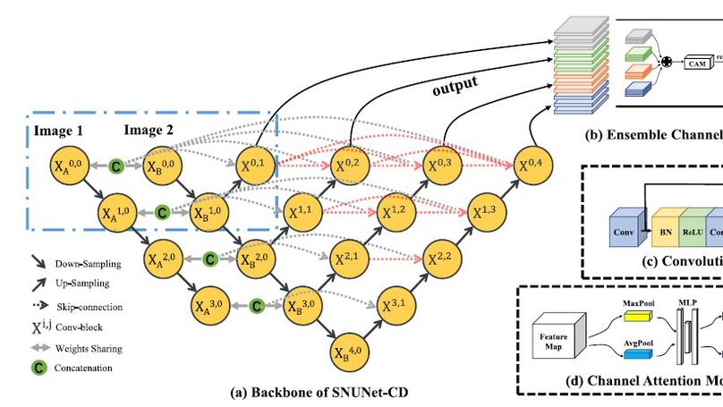
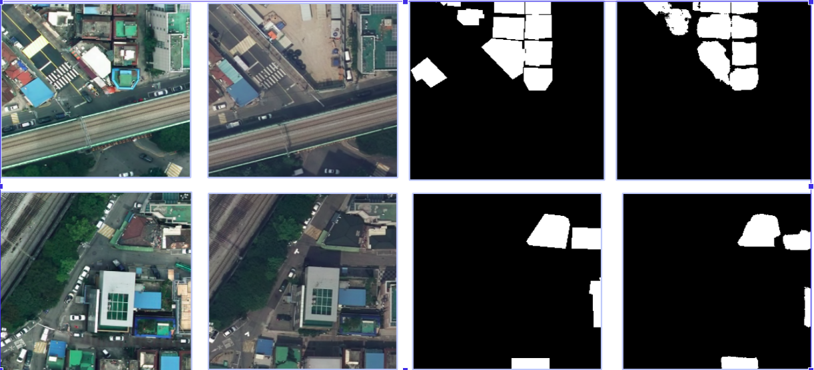
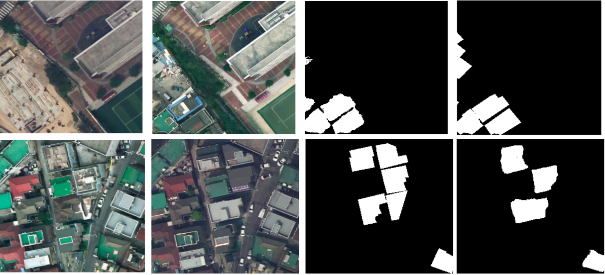

# SNUNet-CD---TensorFlow
SNUNet-CD - TensorFlow 2.0

[SNUNet-CD: A Densely Connected Siamese Network for Change Detection of VHR Images](https://ieeexplore.ieee.org/document/9355573)

Change detection is an important task in remote sensing (RS) image analysis. It is widely used in natural disaster monitoring and assessment, land resource planning, and other fields. As a pixel-to-pixel prediction task, change detection is sensitive about the utilization of the original position information. Recent change detection methods always focus on the extraction of deep change semantic feature, but ignore the importance of shallow-layer information containing high-resolution and fine-grained features, this often leads to the uncertainty of the pixels at the edge of the changed target and the determination miss of small targets. In this letter, we propose a densely connected siamese network for change detection, namely SNUNet-CD (the combination of Siamese network and NestedUNet). SNUNet-CD alleviates the loss of localization information in the deep layers of neural network through compact information transmission between encoder and decoder, and between decoder and decoder. In addition, Ensemble Channel Attention Module (ECAM) is proposed for deep supervision.

## Architecture

I changed the convolution block to ResNet blocks with 2 convolutions of 3x3, also the original code presents some difference with proposal architecture, the attention module CAM presents average pooling and max pooling on the paper, but its implemented with both max pooling on the official implementation, I implemented as the paper. It presented better results with this implementation. Also the skip connections happen after the pooling layer different from the offical presentation making less memory consuming it same results.

# Results

